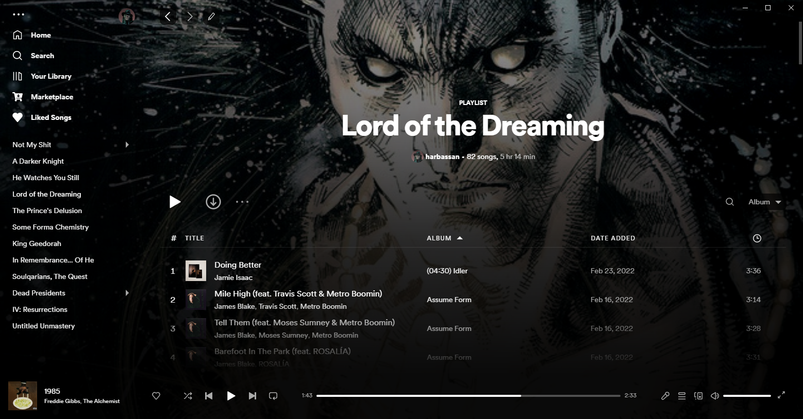

# Spicetify Galaxy

### Uses fullscreen images to greatly improve your Spotify experience. Add your own images to playlists and the home page.

---





---

### Manual Installation

After cloning the repo add the files `user.css` and `color.ini` into a new folder named `Galaxy`, and place this folder into your `Themes` folder in `.spicetify`.

Then run these commands to apply:

```powershell
spicetify config current_theme Galaxy
spicetify config inject_css 1 replace_colors 1 overwrite_assets 1
spicetify apply
```

To enable the extension (which is a necessary step), add the file `extension.js` into the `Extensions` folder in `.spicetify`.

Then run the commands:

```powershell
spicetify config extensions galaxy.js
spicetify apply
```

---

### Customisation

Go into your theme folder and open either:

`color.ini` to modify the colors

`user.css` to modify the code

To change the home image and playlist images you can do so via the edit button that will show in the top left of the page.

There is a limited space for custom images so I would recommend shrinking the file sizes of your images and adding the home page image first. If there is no custom image set for a playlist it will default to the cover image.

---

If you have any questions or issues regarding the theme open an issue on this repo. Please specify your spicetify version and installation method if you do so.
